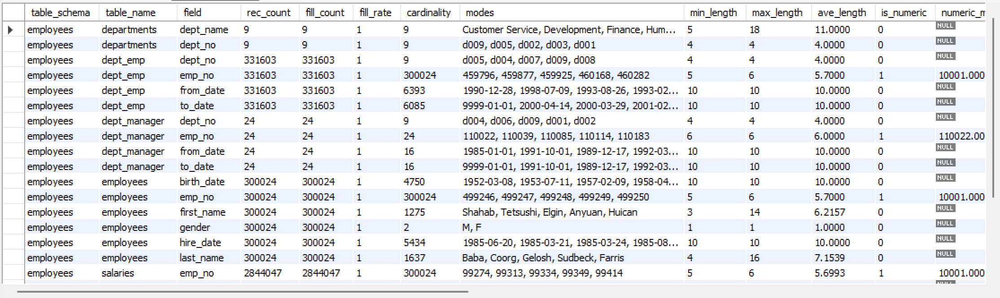

# Setup

Run `setup.sh` or follow these steps:

```bash
python3 -m venv .venv
source .venv/bin/activate
python3 -m pip install --upgrade pip setuptools wheel
python3 -m pip install -r requirements.txt
```

# Usage

The dbt wrapper `dbtw` was created to load environment variable when running dbt.
Instead of doing:

```bash
dbt --version
dbt debug
```

Use `dbtw` instead:

```bash
dbtw --version
dbtw debug
```

Or load/export environment variables yourself and use `dbt` as usual.

Specify the table schema and table name either in profiles.yml or from command line, like so:

```bash
./dbtw run --vars '{"table_schema":"myschema","table_name":"mytable"}'
```

## Variables

This dbt project can be run by just specifying the `table_schema` variable like `--vars '{"table_schema":"myschema"}'` but it's possible to pass other variables to change its behavior and/or results.

- `table_schema`: (**required**) the name of the database/schema to profile. If nothing else is specified, it will profile all fields from all tables within this database/schema.
- `table_name`: the name of the table to profile. If not provided, all tables will be profiles. The default is '' (empty).
- `table_columns`: comma-delimited list of field names to profile. If not provided, all columns will be profiled. The default is '' (empty).
- `max_char_length`: maximum number of characters to be taken into account in columns. See [Consideration](#considerations) below for more details. The default is 100.
- `max_patterns`: maximum number of patterns to be returned for a column. See [Consideration](#considerations) below for more details. The default is 5.
- `max_modes`: maximum number of modes to be returned for a column. See [Consideration](#considerations) below for more details. The default is 5.
- `profile_materialization`: the materialization to use when running dbt for the `profile` model (the final table). Either `incremental` or `table`. If `incremental` provided, dbt will append results to the `profile` table. Otherwise, dbt will re-create (i.e. DROP then CREATE) the `profile` table. The default is `incremental`.


# Examples

## MySQL sakila database

This will create data profile for MySQL's [sakila dataset](https://dev.mysql.com/doc/sakila/en/).

### Download and load dataset

```bash
curl https://downloads.mysql.com/docs/sakila-db.tar.gz -o /tmp/sakila-db.tar.gz
tar zxf /tmp/sakila-db.tar.gz -C /tmp/
# create sakila schema, along with any UDF and UDP
cat /tmp/sakila-db/sakila-schema.sql | mysql -u root -p
cat /tmp/sakila-db/sakila-data.sql | mysql -u root -p
```

### Setup .env

```bash
# if you do not have an .env file yet...
cp .env.sample .env
# then edit .env and specify username, password, host, and port in there
```

### Run dbt-profiler

The following will profile every column in every table in the `sakila` schema:
```bash
./dbtw run --target dev --vars '{"table_schema":"sakila","profile_materialization":"table"}'
```

Takes about 30 seconds on my (Windows WSL2) i7 3GHz 4-core CPU with 32GB of RAM.

### Results

Finally, simply query the `dbt_profiler.profile` table:

```SQL
SELECT * FROM dbt_profiler.profile
```

Extract of results:


## Employees database

This will create data profile for "[300,000 employee records with 2.8 million salary entries](https://github.com/datacharmer/test_db)".

### Download and load dataset

```bash
mkdir /tmp/test_db
git clone https://github.com/datacharmer/test_db.git /tmp/test_db/
cd /tmp/test_db
mysql -u root -p < employees.sql
```

### Setup .env

```bash
# if you do not have an .env file yet...
cp .env.sample .env
# then edit .env and specify username, password, host, and port in there
```

### Run dbt-profiler

The following will profile every column in every table in the `employees` schema:
```bash
./dbtw run --target dev --vars '{"table_schema":"employees","profile_materialization":"table"}'
```

Takes about 4 minutes on my (Windows WSL2) i7 3GHz 4-core CPU with 32GB of RAM.

### Results

Finally, simply query the `dbt_profiler.profile` table:

```SQL
SELECT * FROM dbt_profiler.profile
```

Extract of results:


# Known limitations

* This is MySQL, not Big Query, Snowflake, etc. Queries use MySQL specific keywords and are unlikely to work against other engines.
* Every care was taken to ensure the final schema can hold any length of data, but the schema is figured out with the data, so incremental profiling may fail (e.g. dbt created column with VARCHAR(9) and new incremental profiling is bringing values greater than that)
* Logic is inefficient (at the moment) for bigger databases with lots of tables and lots of columns. The CTE can get quite huge and MySQL might fail in the end with big datasets.

# Considerations

## How is it done?

The profiling is done in 2 steps: first with the `profile_first_stage` model and then with the `profile` model.

In `profile_first_stage`, it will first query the `information_schema` to get the tables and columns for a given database/schema. The logic will then iterate over the results to generate CTEs and `UNION SELECT` statements.
This model will compute enough information so as to NOT break MySQL (e.g. running AVG() on character data within a `CREATE TABLE` statement).

Then the `profile` model is executed. This model depends on the `profile_first_stage` one and will run more computation on numerical data (e.g. MIN, AVG, STDDEV_POP)

## Tweaking results

For each column, 3 Common Table Expressions (CTEs) will be created
- one for the Modes (name ending in `_modes`)
- one for the Patterns (name starting with `_patterns`)
- one for the Quartiles (name ending in `_quartiles`)

For example, for the `sakila.actor.actor_id` column, 3 CTEs are generated:
```sql
, `stats_f_r_actor_actor_id_modes` AS (
    select
        CAST(
            CONCAT(
                SUBSTRING(`actor_id`, 1, 100),
                IF(LENGTH(`actor_id`) > 100, '...', '')
                ) 
            AS CHAR) as __n,
        COUNT(*) as __f -- frequency
    from `sakila`.`actor`
    group by 1
    order by 2 DESC
)
, `stats_f_r_actor_actor_id_quartiles` AS (
    select
        CAST(
            CONCAT(
                SUBSTRING(`actor_id`, 1, 100),
                IF(LENGTH(`actor_id`) > 100, '...', '')
                )  
            AS CHAR) as __n,
        ROW_NUMBER() OVER() as __rn
    from `sakila`.`actor`
    order by 1
)
, `patterns_actor_actor_id` AS (
    select
        CONCAT(
            SUBSTRING(
                REGEXP_REPLACE(
                    REGEXP_REPLACE(
                        REGEXP_REPLACE(
                        `actor_id`,
                        '[0-9]', '9' COLLATE utf8mb4_0900_ai_ci),
                    '[A-Z]', 'A' COLLATE utf8mb4_0900_ai_ci), 
                '[a-z]', 'a' COLLATE utf8mb4_0900_ai_ci),
                1, 100
            ),
            IF(LENGTH(`actor_id`) > 100, '...', '')
        ) as pattern,
        COUNT(*) as f
    from  `sakila`.`actor`
    group by 1
)
```

The Modes CTE will simply calculate the frequency for every value. This yields at max COUNT(*) rows. The model will then take the first 5 (var `max_modes`) mostfrequent values.

The Patterns will replace every character by A (or a) and digits by 9 and calculate their frequency. This might yield at most COUNT(*) rows (usually much less). The model will show the first 5 (var `max_patterns`) most popular  and least popular patterns.

The Quartiles CTE will simply add a row number for every record. The model will then get the record at row `COUNT(*)*0.25` for 1st quartile, `COUNT(*)*0.5` for 2nd quartile, and `COUNT(*)*0.75` for 3rd quartile.

Note that in all cases if the field has more than 100 (var `max_char_length`) characters/digits, it will be truncated to 100 and a "..." will be concatenated to it.

# References

<a id="ref-1">[1]</a> DataPatterns, https://github.com/hpcc-systems/DataPatterns

<a id="ref-2">[2]</a> Iterate over all rows and columns in dbt jinja, https://stackoverflow.com/questions/74898764/iterate-over-all-rows-and-columns-in-dbt-jinja

<a id="ref-3">[3]</a> Dynamic Sql Pivots with dbt, https://serge-g.medium.com/dynamic-sql-pivots-with-dbt-dea16d7b9b63
