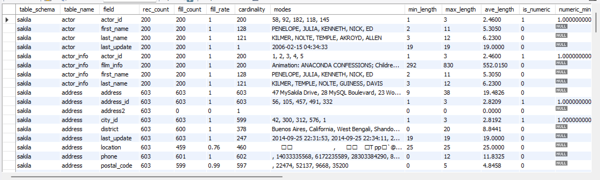

# Setup

Run `setup.sh` or follow these steps:

```bash
python3 -m venv .venv
source .venv/bin/activate
python3 -m pip install --upgrade pip setuptools wheel
python3 -m pip install -r requirements.txt
```

# Usage

The dbt wrapper `dbtw` was created to load environment variable when running dbt.
Instead of doing:

```bash
dbt --version
dbt debug
```

Use `dbtw` instead:

```bash
dbtw --version
dbtw debug
```

Or load/export environment variables yourself and use `dbt` as usual.

Specify the table schema and table name either in profiles.yml or from command line, like so:

```bash
./dbtw run --vars '{"table_schema":"myschema","table_name":"mytable"}'
```


# Examples

## MySQL sakila database

This will create data profile for MySQL's [sakila dataset](https://dev.mysql.com/doc/sakila/en/).

### Download and load dataset

```bash
curl https://downloads.mysql.com/docs/sakila-db.tar.gz -o /tmp/sakila-db.tar.gz
tar zxf /tmp/sakila-db.tar.gz -C /tmp/
# create sakila schema, along with any UDF and UDP
cat /tmp/sakila-db/sakila-schema.sql | mysql -u root -p
cat /tmp/sakila-db/sakila-data.sql | mysql -u root -p
```

### Setup .env

```bash
# if you do not have an .env file yet...
cp .env.sample .env
# then edit .env and specify username, password, host, and port in there
```

### Run dbt-profiler

The following will profile every column in every table in the `sakila` schema:
```bash
./dbtw run --target dev --vars '{"table_schema":"sakila","profile_materialization":"table"}'
```

Takes about 30 seconds on my (Windows WSL2) i7 3GHz 4-core CPU with 32GB of RAM.


### Results

Finally, simply query the `dbt_profiler.profile` table:

```SQL
SELECT * FROM dbt_profiler.profile
```

Extract of results:


## Employees database

This will create data profile for "[300,000 employee records with 2.8 million salary entries](https://github.com/datacharmer/test_db)".

### Download and load dataset

```bash
mkdir /tmp/test_db
git clone https://github.com/datacharmer/test_db.git /tmp/test_db/
cd /tmp/test_db
mysql -u root -p < employees.sql
```

### Setup .env

```bash
# if you do not have an .env file yet...
cp .env.sample .env
# then edit .env and specify username, password, host, and port in there
```

### Run dbt-profiler

The following will profile every column in every table in the `employees` schema:
```bash
./dbtw run --target dev --vars '{"table_schema":"employees","profile_materialization":"table"}'
```

Takes about 4 minutes on my (Windows WSL2) i7 3GHz 4-core CPU with 32GB of RAM.

### Results

Finally, simply query the `dbt_profiler.profile` table:

```SQL
SELECT * FROM dbt_profiler.profile
```

Extract of results:


# References

https://github.com/hpcc-systems/DataPatterns

https://stackoverflow.com/questions/74898764/iterate-over-all-rows-and-columns-in-dbt-jinja

https://serge-g.medium.com/dynamic-sql-pivots-with-dbt-dea16d7b9b63
